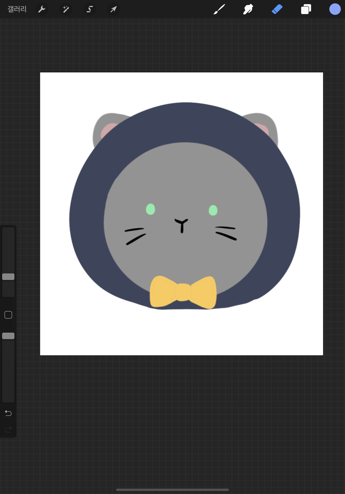

# 😼 마법쏠고양

마법쏠고양은 마우스 제스처로 즐기는 1:1 PVP 슈팅게임입니다. 고양이 마법사가 되어, 지팡이를 휘둘러 마법을 쏘고, 상대를 제압하세요!

**[프로젝트 발표 및 게임 시연](https://youtu.be/F8OHnevCS30?t=10277)**

---

## 프로젝트 동기 및 기획 의도

선을 그려서 커맨드를 입력하는 **마우스제스처** 라는 입력방식에 큰 매력을 느껴, 마우스제스처로 게임을 만들어보고 싶었습니다.

키보드에 비해, 마우스가 손에 주는 피로감은 인지하고 있었습니다만, 그럼에도 불구하고 **"그려서 조작한다"** 라는 게임의 개성을 포기하고 싶지 않았기에 모든 조작은 마우스제스처로 이루어지게 기획하였습니다.

키보드 입력을 포기하면서, 모바일기기 터치 조작으로의 확장 가능성이 열렸습니다. 모바일 브라우저의 성능적인 한계 때문에 게임을 모바일로 하기는 어려워 보입니다만, 추후 모바일 기기를 컨트롤러로 사용할 수 있도록 하여 터치 및 드로잉 조작을 사용자에게 제공할 수 있을 것 같습니다.

마법 사용과 더불어 캐릭터 움직임도 마우스 제스처로만 가능합니다. 따라서 **마법을 그리는 동안 움직일 수 없습니다.** 그리는 데 오래 걸리는 강력한 마법을 사용하기 위해선, 상대 공격에 노출될 위험을 감수해야 합니다. 강력한 마법에 어려운 커맨드를 부여하여 레벨 디자인을 하면, 사용자의 숙련도와 전략에 따라 다양한 게임 양상이 나올 수 있을 것으로 기대됩니다.

---

## 프로젝트 기간 : 총 3주 (2021/05/03 ~ 2021/05/21)

- 시작 : 2021/05/03
- 아이디어 기획, 기술 검토 : 05/03 (월) ~ 05/07 (금)
- 메인, 호스트 룸, 게스트 룸 등 메뉴 구현 : 05/08 (토) ~ 05/10 (월)
- 백엔드 구현 : 05/10 (월) ~ 05/12 (수)
- 마우스 제스쳐 구현 : 05/12 (수)
- 배틀 씬 유저인터페이스 구현 : 05/13 (목) ~ 05/14 (금)
- 게임 로직 구현 : 05/15 (토) ~ 05/20(목)

---

## 사용법

### 매칭 방법

- 메인 메뉴입니다.
- 게임을 생성하여 초대코드를 다른 사람에게 주거나, 다른 사람의 초대코드를 받아, 게임에 참가할 수 있습니다.

---

- 게임 생성 시, 호스트 룸 화면입니다.
- 초대코드를 확인할 수 있습니다. 복사 버튼을 누르면 코드가 클립보드로 복사됩니다.

---

- 게임 참가 버튼을 누르면 초대코드 입력 창이 나옵니다.
- 다른 사람의 초대코드를 받아, 입력하면 게임에 참가할 수 있습니다.

---

- 두 플레이어가 모두 접속하면 호스트 플레이어 화면에서 게임 시작 버튼이 활성화됩니다.
- 게임 시작 버튼을 클릭하면 게임이 시작됩니다.

---

### 게임 방법

- 두 플레이어는 각자의 4 * 4칸에서만 움직일 수 있습니다.
- 마법을 사용하여 상대의 HP를 0으로 만들면 승리합니다.
- 시작 HP는 100입니다.
- 마법은 회피 가능합니다. 끊임없이 움직이세요!
- 자신의 커맨드는 좌측 상단에서 화살표 아이콘들로 확인할 수 있습니다.
- 상대의 커맨드도 우측 상단에서 확인할 수 있습니다. 커맨드를 입력해두고 유인하는 상대에게 속지 마세요!

---

### 커맨드 목록

**이동하기** : (어느 방향으로든) 1획

**화염구 쏘기** : ➡ ⬅ ➡

**번개 내려치기** : ⬇ ⬅ ➡ ⬅ ⬇

**포탑 설치하기** : ➡ ⬆ ➡ ⬇ ➡

**지뢰 마법 설치하기** : ➡ ⬇ ➡ ⬆ ➡

---

**이동하기** : (어느 방향으로든) 1획

모든 방향 1획 입력은 이동 커맨드입니다.

민첩하게 움직여 상대의 마법을 피하세요!

---

**화염구 쏘기** : ➡ ⬅ ➡

가장 기본적인 공격 방법입니다. 연습하면 빠르게 연사도 가능합니다!

---

**번개 내려치기** : ⬇ ⬅ ➡ ⬅ ⬇

자신의 그리드와 같은 줄, 같은 칸의 상대 진영에 번개를 내려칩니다.

공격 유효범위가 단 한 칸이기 때문에 맞히기 어렵지만 매우 강력합니다.
번개 마법으로 일발 역전을 노려보세요!

---

**포탑 설치하기** : ➡ ⬆ ➡ ⬇ ➡

일정 간격으로 화염구를 자동으로 발사하는 포탑을 설치합니다.

한 번에 단 하나만 설치할 수 있습니다.

윗줄, 아랫줄 구석보다는 가운뎃줄에 설치하여 상대를 압박하세요!

---

**지뢰 마법 설치하기** : ➡ ⬇ ➡ ⬆ ➡

밟으면 폭발하는 지뢰 마법을 설치합니다.

상대가 밟지 않으면 10초 후에 사라집니다.

포탑과 마찬가지로 가운데 설치하여, 위치를 선점하고 상대의 움직임을 봉쇄하세요!

같은 위치에 겹쳐서 설치할 수 있습니다(!)

---

## 마우스제스처 구현 방식

출처 : [https://www.codeproject.com/Articles/10681/The-Poor-Man-s-Mouse-Gesture](https://www.codeproject.com/Articles/10681/The-Poor-Man-s-Mouse-Gesture)

마우스제스처 구현 방식은 아래와 같은 방식을 취했습니다.

1. 마우스 커서를 중심으로 가상의 사각형을 만듭니다.
2. 사각형의 선에 마우스 커서 닿으면 해당하는 방향으로 한 획을 그린 것으로 간주하고 해당 방향을 입력받습니다.
3. 커서가 사각형의 선에 닿은 지점을 중심으로 다시 사각형을 그립니다. 반복합니다.
4. 만약 다음 인식한 방향도 이전과 같은 방향이면, 여전히 같은 획을 긋고 있는 것으로 간주하고, 방향을 입력받지 않습니다.
5. 다른 방향의 사각형 선에 닿으면 또 다른 획으로 간주하고 방향을 입력받습니다.

검색 결과, 인공신경망을 통한 패턴 학습으로 마우스제스처를 인식하는 방식도 있었으나, 인식률을 높이는 것 보다 정적인 조건 위에서 정확한 입력을 받아야 하는 방식이 게임이라는 콘텐츠에 더 적절할 것으로 판단하여 위와 같은 방식으로 구현하였습니다. `마법쏠고양` 은 격투 게임과 같이 **커맨드 미스** 라는 개념이 있는 게임이길 바랐습니다.

---

## 사용 기술과 기술 사용 소감

### 1. Pixi.js

[PixiJS](https://www.pixijs.com/)

`PixiJS` 는 WebGL을 사용하는 렌더링 라이브러리입니다.

개인적으로 인터랙티브한 요소를 좋아하여 관련 작품들을 찾아보곤 하는데 훌륭한 작품들에 자주 사용되는 것을 보고 기회가 되면 꼭 사용해보고 싶었습니다.

기획 단계에서 게임 로직 구현을 위해 PixiJS와 함께 canvas api, Phaser 도 사용을 고려했었습니다만, canvas api는 이미 사용 경험이 있었기에, 새로운 기술을 경험해보고 싶어서 사용하지 않기로 하였고, Phaser는 게임엔진을 표방하는 만큼 지나치게 게임이라는 장르에 초점이 맞추어졌다는 느낌을 받아, 이후에 2D 그래픽 프로젝트를 하는 데 있어, 범용적으로 사용하기 어려울 것 같아서 사용하지 않기로 했습니다.

이전에 canvas api를 사용했을 때와 비교해서 보자면, 라이브러리인 만큼 확실히 추상화되어 제공되는 메소드들이 많아서, 훨씬 편하게 기능들을 구현할 수 있었습니다. 리액트가 컴포넌트 단위로 구성되어있다면, PixiJS는 컨테이너 단위로 구성되어 있는 느낌이라 구조설계를 리액트와 비슷하게 구성하였고 어렵지 않게 적응할 수 있었습니다. 다만 당연하게도 리액트가 아니므로, 리렌더 로직이나 useEffect 같은 역할을 하는 로직을 따로 작성해주어야 했습니다. 나중에 찾아보니 `[React Pixi](https://reactpixi.org/)` 라는 라이브러리도 있어서, 이를 활용하면 이러한 불편함을 해소할 수 있을 것 같아, 다음에 리액트 위에서 픽시를 쓸 일이 있다면 꼭 활용해 볼 생각입니다.

### 2. Socket IO / SimplePeer 그리고 게임 서버 구조

기획단계에서 끝까지 고민했던 부분이 게임 서버 구조였습니다. `SocketIO` 만으로 통신하게 하면서 client-server구조로 설계할까, 아니면 `SimplePeer` 로 연결하여 클라이언트들끼리만 통신하는 P2P 구조로 설계할까 고민하다가, 1:1 게임인 만큼 P2P 방식이 어렵지 않겠다 싶어, 도중에  `SimplePeer`를 끼워 넣어, P2P 구조로 방향을 잡았습니다.

`socketIO`로 호스트와 게스트를 연결하고, 게임 시작 시 `simplePeer`에서 제공하는 peer 객체를 socket을 통해 주고받은 후, 피어 연결을 마치고 socket 연결을 종료하도록 구현하였습니다. 이후 게임 로직은 피어를 통해 이루어집니다.

게임 서버 구조에 대해서 알아보며 이해한 바로는, c/s 구조에선 서버에서 게임의 주요 로직을 모두 갖고 관리하기 때문에, 상태변화가 일어났을 때, '클라이언트에 언제 갱신된 정보가 전달될 것인가' 즉 레이턴시가 주요한 문제라면, P2P에선 '여러 클라이언트들이 관리하는 상태를 어떻게 일관되게 동기화하는가'가 관건이었습니다. 실제로 P2P 구조로 개발을 진행하며, 분할된 상태로 인한 어려움을 느끼기도 하고, 실제로 관련한 문제를 겪기도 하였습니다.

화염구 투사체를 각 클라이언트가 배열로 관리하게 했었고, 출현, 소멸(화면 밖으로 나가거나 폭발)마다 수시로 화염구 인스턴스들을 배열에 추가하거나 삭제하며 배열을 갱신해주는 상황이었습니다. 플레이어가 피격되고 어떤 화염구에 피격됐는지 상대 클라이언트에게 전달해야 하는 상황에서, 전달 출발 후 전달 도착 전 아주 짧은 시간에 상대 클라이언트가 화염구를 생성하거나 제거하면, 전달받는 화염구 index가 어긋나서 버그를 일으켰습니다. 결국 수시로 index가 변경될 여지가 있는 배열이 아닌 객체로 화염구를 관리하고 화염구들 별로 고유 index를 설정하여 해결하였습니다만, 분산된 상태를 동기화하는 과정에서 어떤 식으로 문제 발생하는지 실감해 볼 수 있었습니다.

지금까지 상태관리에 대해서 react의 useState나 redux로 단일 클라이언트 상태만 경험해 봤기 때문에, 여러 상태를 서로 통신시키며 동기화하고 관리하는 경험은 어렵고도 신선했습니다. 특히, 통신을 무겁게 하지 않으려고, 동기화를 위한 최소한의 정보만을 통신하게 하고 싶었는데, 어떤 정보가 동기화를 위해 꼭 필요한 정보인지 추려내는데 꽤 많이 고민했던 것 같습니다.  처음 겪어보는 구조였기에 설계면에서 많이 애먹었지만, 이번 기회로 다음에 비슷한 상황에서 더 잘 해낼 수 있겠다는 자신감도 얻을 수 있었습니다.

---

## 프로젝트를 마치며

예전부터 조금씩 느꼈지만, 이번 프로젝트를 해보며 확실하게 인지하게 된 점은 저 자신이 코딩만큼이나 개발 자체를 좋아한다는 점이었습니다. 코드만큼이나 프로그램 전체의 완성도에 욕심이 났었고, 그만큼 마법 별 마우스제스처나 캐릭터 모션 등을 기획하는 데 시간과 정성을 들였던 것 같습니다.

한 편으로는, 기획에 너무 욕심을 내는 바람에, 시간적으로나 기술적으로나 기획한 내용을 구현해낼 수 있을까 많이 불안했지만, 막상 완성된 게임을 보니 해냈다는 안도감과 함께, 다른 어떤 프로젝트도 기획만 있다면 어떻게든 해낼 수 있겠다는 자신감도 생겼습니다.

픽시의 컨테이너를 중심으로 한 클래스 위주의 객체지향구조로 설계한 만큼, 이번 프로젝트를 진행하며 관심사, 재사용성 등 구조적인 부분에 대해 고민을 많이 했습니다. 새로운 기능을 확장할 때마다, '이 클래스를 재사용할걸', '이 클래스의 이 기능은 분리해 놓을걸' 하고 실수를 곱씹으며, 거의 개발 시간의 1/3을 리팩토링에 투자했던 것 같습니다.

구조 문제와 더불어 여러 문제를 맞닥뜨리며 느낀 점은, 문제를 가시화하는 것과는 별개로 그 문제를 어떤 패턴으로 어떻게 해결할지에 대해서 정말 아무것도 모르는구나 하는 무력함이었습니다. 결국 저는 제 코드에 매몰되어서 제 코드와 제 생각으로만 문제를 해결해야 하는 우물 안의 개구리였고 새로운 해결 방법을 도입하고, 더 나은 코드를 작성하기 위해서, 이제는 코딩에 대한 직접적인 경험을 쌓는 것 이상으로 다른 분들의 코드를 많이 읽어야겠다고 절실히 실감했습니다.

계획했던 것보다 간소화하거나 생략한 부분도 많고, 코드도 여러 부분에서 부족하지만, 기대한 만큼의 게임이 나와주어 나름 만족스럽습니다. 바쁘게 일하는 와중에도, 게임 그래픽 디자인을 도맡아 해준 동생 향기, 힘들어할 때마다 격려와 칭찬으로 밀어주고 끌어주던 동기분들, 그리고 예비 개발자들의 성장을 위해 지원을 아끼지 않으셨던 켄님과 멘토님들, 리뷰어님들께 감사드립니다. 아직 여러모로 미숙하지만 장차 좋은 개발자, 함께 일하고 싶은 개발자가 될 수 있도록 분발하겠습니다.

---

## 기타 사항

### 그래픽 디자인 소스 출처

고양이 캐릭터, 메인메뉴 배경, 배틀 씬 배경, 지뢰 마법, 포탑 마법 디자인 :
박향기(min4247519@naver.com)

기타 마법 이펙트 :

[ArtStation - 15 Sprite Effects | Game Assets](https://www.artstation.com/marketplace/p/W1jK/15-sprite-effects)

---

### 디자인 시안들

1. 동생이 보내온 공격모션 최초 시안

2. (...)열심히 모션 설명 중...

3. 협의 이후 공격모션 러프

4. 여차여차해서 최종 채택된 공격 모션

#### 그 외 탈락한 디자인들.

패배 모션 최초 시안

HP바 옆 초상화 시안.

메인 메뉴 시안1

메인 메뉴 시안2

포탑.
높이가 너무 높아서, 높이를 맞추면 투사체가 윗줄에서 나가는 것처럼 보여 중간에 탈락.
